# 人工智慧期末報告-在Google Colab 中快速實踐深度學習
<h2>
  組員:  10924149黃子瑜 、11128004林峻成
</h2>

# Colaboratory

```Colaboratory```是一個免費的Jupyter 筆記本環境，不需要進行任何設定就可以使用，並且完全在雲端運行。借助Colaboratory，
我們可以在瀏覽器中編寫和執行程式碼、保存和共享分析結果，以及利用強大的運算資源，包含GPU 與TPU 來運行我們的實驗程式碼。


```Colab``` 能夠輕鬆地與Google Driver 與Github 鏈接，我們可以使用[Open in Colab](https://chromewebstore.google.com/detail/open-in-colab/iogfkhleblhcpcekbiedikdehleodpjo)  插件快速打開Github 上的Notebook，
或者使用類似於 [https://colab.research.google](https://colab.research.google.com/github/googlecolab/colabtools/blob/master/notebooks/colab-github-demo.ipynb)
...這樣的鏈接打開。如果需要將Notebook 儲存回Github，
直接使用File→Save a copy to GitHub即可。譬如筆者所有與Colab 相關的程式碼歸置在了AIDL-Workbench/colab。


# 依賴與運行時
### 依賴安裝
Colab 提供了便利的依賴安裝功能，允許使用pip 或apt-get 指令進行安裝：
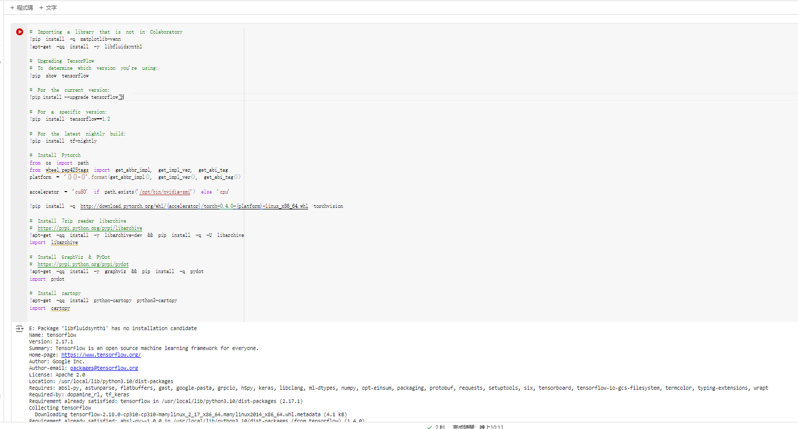
在Colab 中還可以設定環境變數：


# 硬體加速
我們可以透過以下方式查看Colab 為我們提供的硬體：
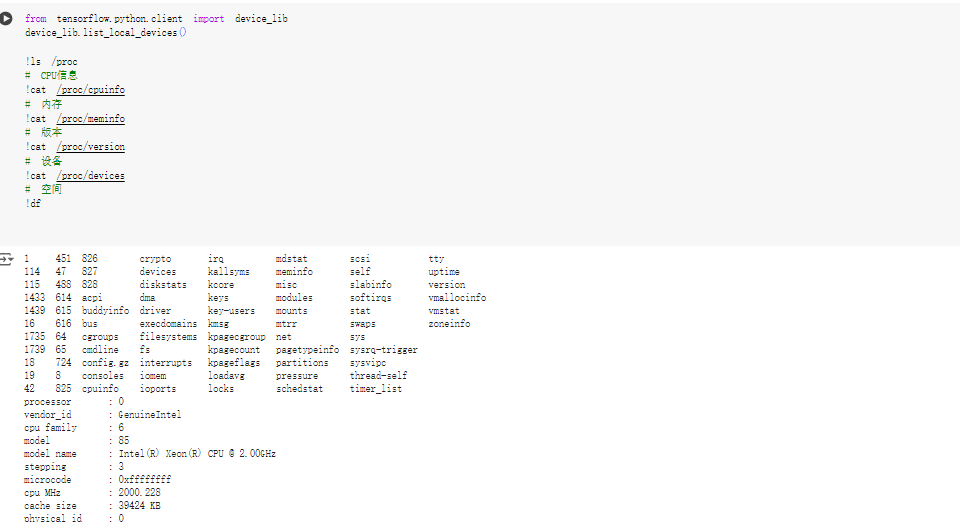
如果需要為Notebook 啟動GPU 支援：Click Edit->notebook settings->hardware accelerator->GPU，然後在程式碼中判斷是否有可用的GPU 裝置：
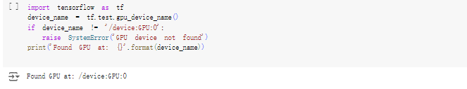
我們可以透過建構經典的CNN 卷積層來比較GPU 與CPU 在運算上的差異：
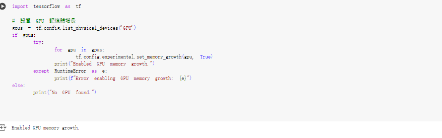

# 本地運行
Colab 也支援直接將Notebook 連接到本機的Jupyter 伺服器以執行，首先需要啟用jupyter_http_over_ws 擴充功能：
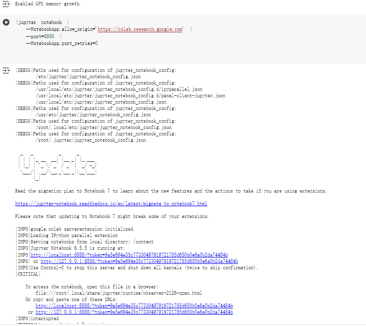
然後在Colab 的Notebook 中選擇連接到本機程式碼執行程式即可。

# 數據與外部模組  Google Driver
Colab 中的notebook 和py 檔案預設都是以/content/ 作為工作目錄，需要執行指令手動切換工作目錄，例如：
在過去進行實驗的時候，大量訓練與測試資料的取得、儲存與載入一直是令人頭痛的問題；在Colab 中，
筆者將Awesome DataSets https://url.wx-coder.cn/FqwyP ) 中的相關資料透過AIDL-Workbench/datasets中的腳本持久化儲存在Google Driver 中。
在Colab 中我們可以將Google Driver 掛載到當的工作路徑：

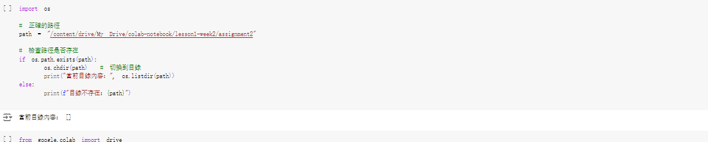
然後透過正常的Linux Shell 指令來建立與操作：
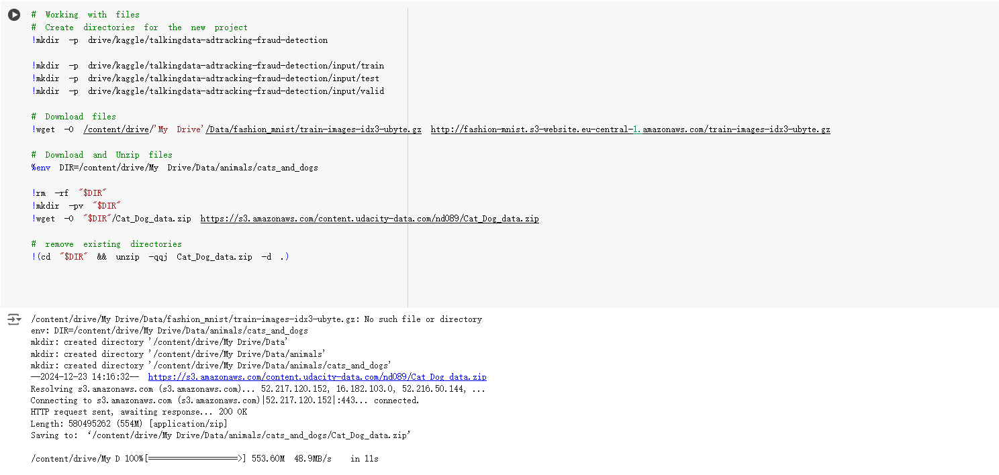

# 文件上傳與下載
Colab 也允許我們在執行腳本時候直接從本機檔案上傳，或將產生的模型下載到本機檔案：
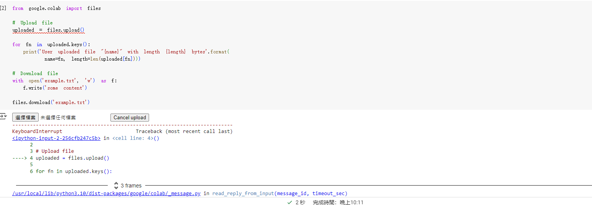
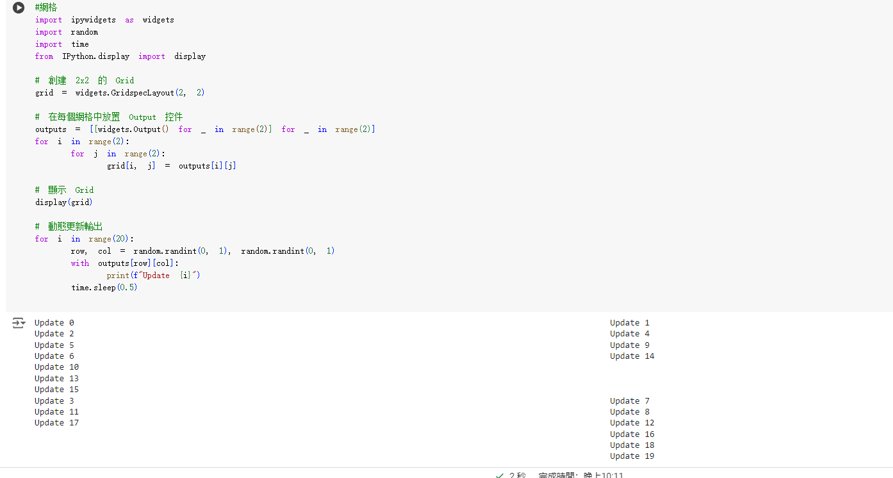

# 控制使用
### 網格
Colab 為我們提供了Grid 以及Tab 控件，來便於我們建立簡單的圖表佈局：
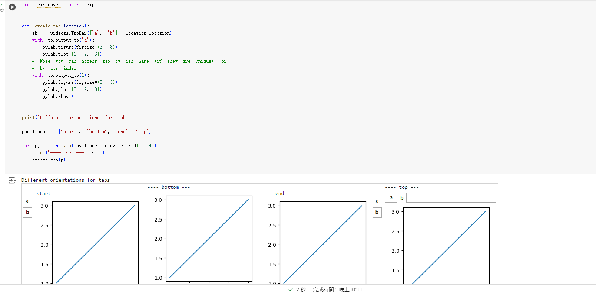


TabBar 提供了頁籤化的版面：     
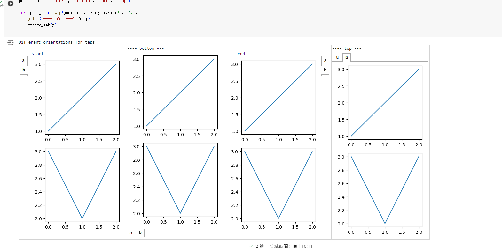


# 表單
值得稱讚的是，Colab 還提供了可互動的表單元件，來方便我們建立可動態輸入的應用：
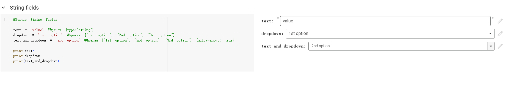


# 參考資料[在Google Colab 中快速實踐深度學習](https://zhuanlan.zhihu.com/p/69558211)
